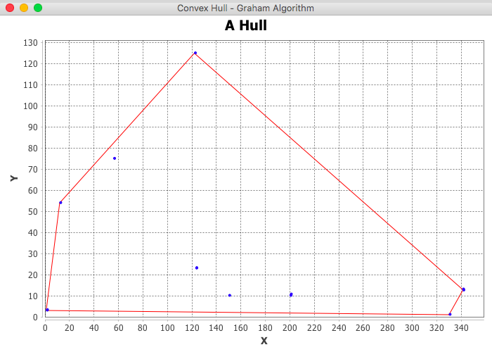

# Convex Hull Algorithm (Graham)

Implementation of the Graham algorithm for finding a convex hull with UI based on jfree-chart.

Given the set of points in the 2D dimension
```
1.12 3.23
123.1 23.1
200.33 10.64
341.2 12.56
1 3
123 23
200 10
341 13
56 75
12 54
122 125
330 1
150 10
```
the resulting convex hull will be the following:


